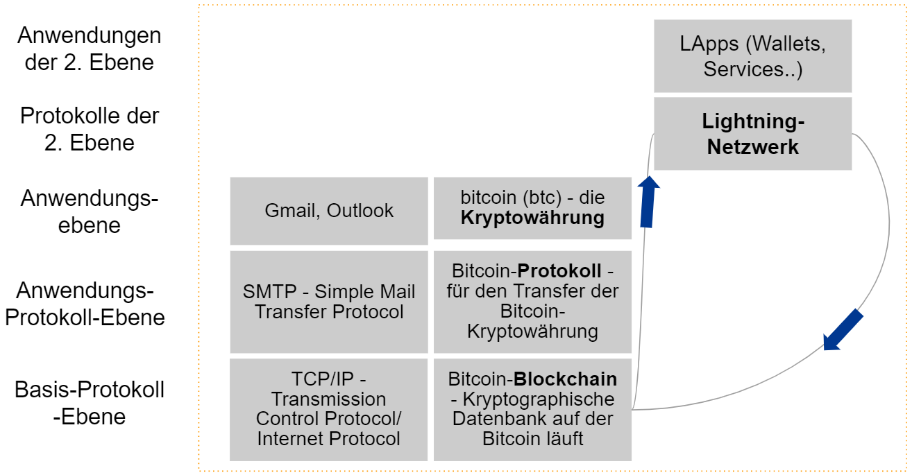

## Bitcoin, das Internet der Werte

Bitcoin ist nicht nur Internet-natives Geld, sondern auch eine öffentliche Internet-Infrastruktur. Es basiert auf einem Internet-Protokoll, über das Werte zwischen von Menschen bedienten Computern, aber auch autonomen Maschinen übertragen werden können. Autos werden etwa in der Zukunft nicht nur selbstständig fahren können, sondern auch selbst zur Ladestation navigieren um sich aufzuladen. Die Bezahlung kann automatisch mit Bitcoin erfolgen, ohne dass irgendjemand manuell eingreifen muss. 

Ein Protokoll regelt den Austausch von Informationen oder den Ablauf von Prozessen. Zwischen Menschen ist beispielsweise die Sprache ist ein Protokoll. Mache ich eine Pause beim Sprechen, weiß mein Gegenüber, dass es jetzt an der Reihe ist. Jedes Wort in einer Konversation hat eine Bedeutung, jede Betonung ändert den Ausdruck. Das menschliche Sprachprotokoll reguliert die Kommunikation zwischen zwei oder mehr Personen. Computer sprechen ebenfalls miteinander. Ihre Protokolle heißen beispielsweise SMTP für E-Mail Versand, FTP für das Senden von Dateien oder HTTPS für den Besuch von Webseiten. Die jeweiligen Protokolle sind für den Datenaustausch verantwortlich, sodass ein Computer den anderen verstehen kann.

### Der Internet-Protokollstack
Das Bitcoin-Protokoll kann mit der Struktur des Internet-Protokolls verglichen werden. 

 [^23]

Die Bitcoin-Blockchain ist ein neues Internet-Protokoll, das man mit dem TCP/IP-Protokoll, der Basis des Internets, vergleichen kann. Aufbauend auf der Bitcoin-Blockchain transferiert das Bitcoin-Protokoll Werte ähnlich dem SMTP-Protokoll für den E-Mail-Versand. Darauf liegt Bitcoin als Anwendung ähnlich zu E-Mail-Software wie Gmail oder Outlook. Dies nennt man den Baselayer (Basisebene) von Bitcoin.

### Das Lightning-Netzwerk
Auf diesem Basislayer können weitere Ebenen eingerichtet werden, so wie das seit 2018 laufende Lightning-Netzwerk. Deshalb werden diese Protokolle als zweite Ebene bezeichnet. 

Das Lightning-Netzwerk ermöglicht eine Vielzahl an Transaktionen gleichzeitig, die aufgrund der beschränkten Blockgröße auf dem Basislayer nicht umsetzbar sind. Gleichzeitig sind damit Mikrozahlungen im Milli-Cent Bereich möglich, die völlig neue Anwendungen zulassen. Durch die Nutzung privater Zahlungskanäle zwischen einzelnen Knoten verfügen Lightning-Zahlungen über höheren Datenschutz als Bitcoin-Basislayer-Transaktionen. Zahlungen hüpfen von einem Knoten zum nächsten, bis sie ihr Ziel erreichen. Die einzelnen Knoten kennen dabei nur den vorherigen und den nächsten Knoten. Das heißt, es ist unmöglich nachzuvollziehen, wer Sender und Empfängerin ist. 

Auf dem Lightning-Netzwerk entstehen eine Vielzahl an Wallets, Finanz-Dienstleistungen und Kommunikationsanwendungen, denen automatisch die Sicherheitseigenschaften von Bitcoin zugrunde liegen.

[^23]: Anita Posch inspiriert von [Melanie Swan](https://www.slideshare.net/lablogga/bitcoin-and-blockchain-explained-cryptocitizen-smartnetwork-trust)
