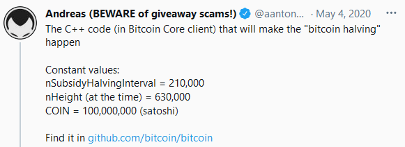
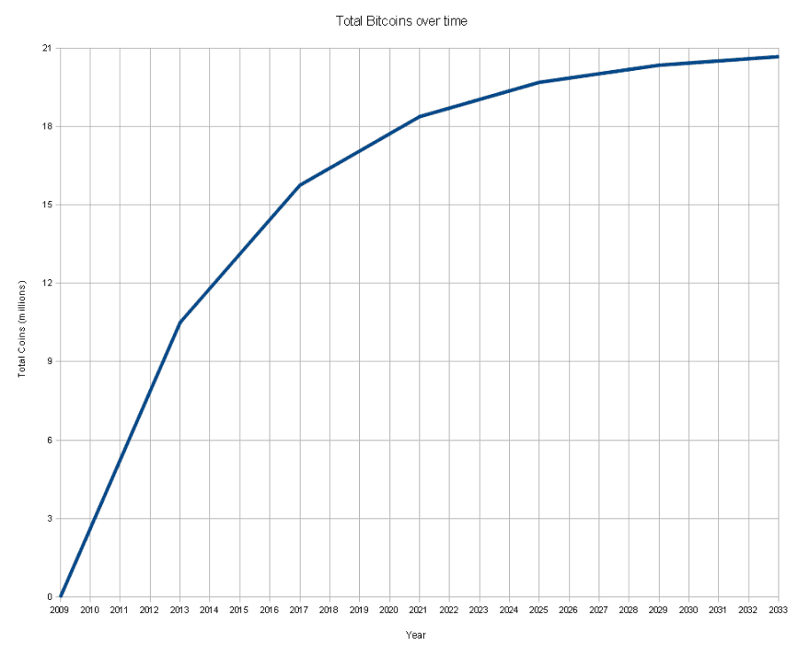

## 21 Millionen Bitcoin
Wie auf den vorigen Seiten beschrieben, werden Bitcoin geschaffen, sobald ein Mining-Computer eine Rechenaufgabe löst und als Erster den neu erzeugten Block an die Blockchain anhängt. 

Derzeit erhalten Miner dafür 6,25 Bitcoin. Dies dient als Anreiz, dass sie den Regeln des Netzwerks folgen und nicht beginnen Transaktionen in ihrem Sinn zu verändern.

### Halving
Die Bitcoin-Regeln legen fest, dass sich die ausbezahlte Menge an Bitcoin alle 210.000 Blöcke - etwa vier Jahre - halbiert. Zu Beginn wurden 50 Bitcoin pro Block geschaffen. Seit Mai 2020 sind es die genannten 6,25. Im Jahr 2024 wird wieder halbiert und die Miner erhalten 3,125 Bitcoin pro Block. Dieses Ereignis wird als Halving (Halbierung) bezeichnet. 

Satoshi Nakamoto programmierte diese Intervalle in die Bitcoin Core Software. Die Ausgabemenge halbiert sich regelmßig, woraus sich eine reduzierende **Mengenkurve?????** ergibt.   The output quantity decreases over time, resulting in a flattening supply curve.  

 [^24]

Durch den festgelegten Algorithmus ergibt sich, dass es maximal 21 Millionen Bitcoin geben wird. Derzeit sind etwa 18,7 Millionen in Umlauf. Im Jahr 2140 werden alle 21 Millionen erzeugt und im Umlauf sein. Das Mining wird weiter stattfinden, die Miner werden jedoch ausschließlich durch die Transaktionsgebühren ihre Kosten decken müssen. Zu.....

This algorithm tends to zero such that there will be a maximum of 21 million bitcoin. There are currently around 18.7 million in circulation. In 2140 all 21 million bitcoin will have been generated. Mining will continue and the miners will be rewarded solely with transaction fees. By that point, it is expected that Bitcoin as a network will have such high adoption that transaction fees alone will adequately facilitate fair reward for miners.

 [^25]

### Why 21 Million?
Why did Satoshi Nakamoto choose 21 million for the supply cap? There are many theories, but here is Satoshi's answer:

 [^26]

### Bitcoin Units
The smallest denomination unit of a bitcoin is a satoshi. 1 bitcoin is comprised of 100,000,000 satoshis; 1 satoshi is one hundred millionth of 1 bitcoin (0.00000001).

You do not have to buy or sell 1 bitcoin at a time, you can start small and transact a minuscule fraction of it.

### Bitcoin or bitcoin, but Never BitCoin

Bitcoin with a capital B is used when referring to the Bitcoin network, the blockchain, the community and the concept as a whole, whereas bitcoin with a lowercase b is used to reference the currency, the bitcoin token. 

In fact, coin is the wrong term to describe the digital asset, it is a little bit misleading. In technical terms it is called UTXO - unspent transaction output. A UTXO defines the amount of value that is stored on the blockchain at a specific Bitcoin address. Therefore there are diverging opinions as to if there is a plural for bitcoin, the unit, because it's fluid and there are no set individual coins. But since Satoshi Nakamoto spoke of bitcoins, we as a community name it that way too. There is no plural for Bitcoin, as there is only one blockchain and network.

Scams like the BitClub network referred to it as BitCoin and this is often mistakenly used by Bitcoin beginners too.

[^24]: [Source Andreas M. Antonopoulos](https://twitter.com/aantonop/status/1257366095515848716?s=20)

[^25]: [Source: Insti](https://commons.wikimedia.org/wiki/File:Total_bitcoins_over_time.png)

[^26]: [Source plan99.net](https://plan99.net/~mike/satoshi-emails/thread1.html)
