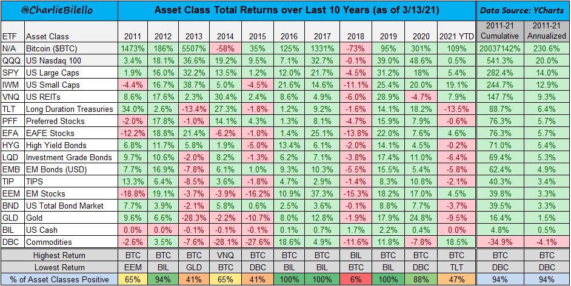
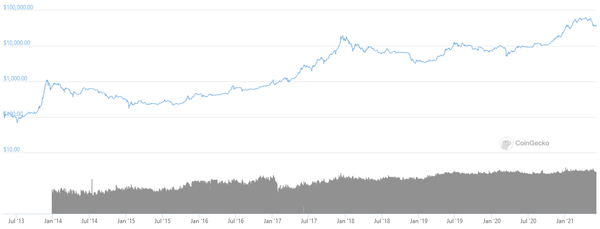
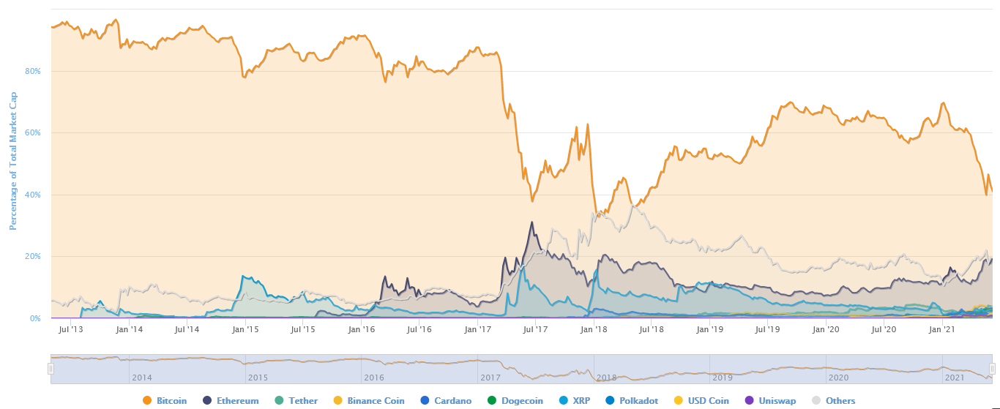
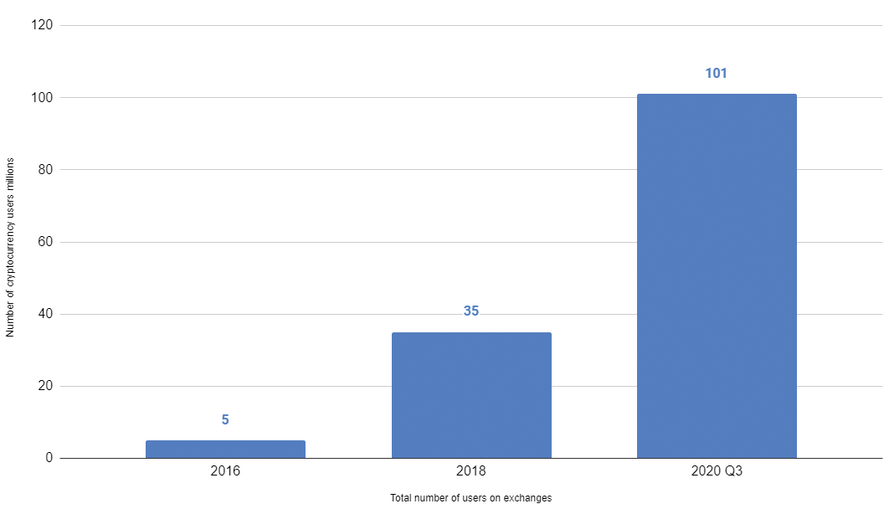

## Argumente gegen Bitcoin

### Volatilität

_Der Bitcoin Kurs schwankt so stark, deshalb kann es nicht als Zahlungsmittel dienen._

Ja, der Bitcoin Preis ist volatil. Der Wert kann in kurzer Zeit stark steigen oder sinken. Sie können dennoch Bitcoin als Zahlungsmittel verwenden. Tauschen Sie einfach denselben Betrag am selben Tag von Euro in Bitcoin. Ergebnis: keine Volatilität, weder Verlust noch Gewinn.

### Kursentwicklung
_Bitcoin ist aufgrund seiner Kursentwicklung kein Wertspeicher._

Betrachten wir Bitcoin als Langzeit-Investment, ist es die am besten performende Anlageformen im letzten Jahrzehnt.

 [^27]

Es gibt natürlich keine Garantie, dass diese positive Entwicklung sich in den kommenden Jahren genauso fortsetzt. Während der Entstehung dieses Buches befand sich Bitcoin in einem Bullenmarkt, der im vierten Quartal 2020 begann. Der Kurs stieg monatelang mit kleineren Rückschlägen an. Im Mai 2021 fiel der Kurs stark, was viele als gesunden Rückgang in einem überhitzten Markt interpretierten.

Der vorige Bullenmarkt startete 2017 und ging bis Anfang 2018. Seither entwickelte sich der Preis seitwärts, wie es in der Sprache der Börse heißt, was bedeutet, dass sich der Preis nur marginal nach oben oder unten veränderte. 

[^28]

Die Bitcoin-Kursentwicklung folgt den Halbierungszyklen. Etwa alle vier Jahre halbiert sich die Menge der neu geschürften Bitcoin. Das heißt, das Wachstum an Bitcoin am Markt verkleinert sich, weshalb der Preis steigen wird, selbst wenn die Nachfrage nach Bitcoin am gleichen Level bleibt. 

### Digitale Knappheit
Die gesamte Bitcoin-Menge ist auf 21 Millionen limitiert. 18,7 Millionen sind bereits auf dem Markt. Alle vier Jahre, genauer gesagt, alle 210.000 Blöcke, reduziert sich die Menge der neu geschürften Bitcoin, um die Hälfte. Derzeit werden alle 10 Minuten 6,25 Bitcoin erzeugt. Das sind 900 Bitcoin pro Tag und 328.500 pro Jahr. Ab 2024 werden nur 450 Bitcoin pro Tag neu auf den Markt kommen, weil nur mehr 3,125 Bitcoin pro Block ausgegeben werden. Dadurch wird die Menge an neu verfügbaren Bitcoin geringer und die Menge knapper. Steigt das Interesse an Bitcoin im selben Zeitraum, steigt der Preis exponentiell.

Im Mai 2021 mussten beispielsweise täglich rund 36 Millionen USD (Anzahl täglich geschürfter Bitcoin * aktueller Preis) in Bitcoin getauscht werden, damit sich der Preis bei 40.000 USD hielt. Fällt der Preis, bedeutet es, dass weniger Bitcoin gekauft wurden, als verfügbar waren und umgekehrt. 

Untenstehende Grafik zeigt den Zeitpunkt der Halbierungen (Halvings). Der Kurs verhielt sich in allen Phasen vor und nach den Halvings ähnlich. In diesem Chart wird der Kurs-Höhepunkt im September 2021 vorhergesagt. Danach fällt der Kurs, was Sie an den "Low" markierten Linien erkennen können. Dies ist eine Annahme, die auf wenigen historischen Ereignissen beruht, weshalb es eine reine Hypothese ist.

 [^29]

Seit Bitcoins Start im Jahr 2009 gab es mehrere Kurs-Zusammenbrüche. Sicher ist, dass diese wieder auftreten werden. Die Frage ist, wie weit wird der Kurs fallen, denn auf einer logarithmischen Skala können Sie erkennen, dass Bitcoin im Verlauf der Zeit nur an Wert gewonnen hat.

  [^30]

> Versuchen Sie nicht cleverer als der Markt zu sein und traden Sie nicht. Halten Sie ihre Bitcoin. Mindestens für fünf Jahre.

In einem Bärenmarkt, wenn der Kurs stark fällt, werden Sie das Gefühl haben, dass Ihr Vermögen schrumpft. Es sinkt aber nur der Wert in Fiat-Geld, ihre Menge an Bitcoin bleibt dieselbe. 0,3 Bitcoin im Bärenmarkt sind genauso 0,3 Bitcoin im Bullenmarkt. Dieser Gedanke hat mir durch so manches Tief geholfen. Ihr Verlust entsteht durch den Vergleich des Bitcoin-Kurses zu einer anderen Anlageform oder Euro. Bleiben Sie geduldig, verkaufen Sie nicht. Die Geschichte zeigt, dass langfristiges Halten ein zuverlässiger Weg ist, Ihr Vermögen zu sichern. 

> Investieren Sie nur soviel in Bitcoin, wie Sie gewillt sind zu verlieren. Wenn Ihnen der Kursverfall schlaflose Nächte bereitet, halten Sie vermutlich zuviel von einem riskanten Asset wie Bitcoin.

### Kein Widerrufssrecht? No Recourse
  
_Senden Sie Bitcoin an eine falsche Adresse, sind sie für Sie verloren. Sie können sie nicht zurückfordern._

Kontrollieren Sie eine Bitcoin-Adresse  mehrmals, bevor Sie Bitcoin senden. Zahlungen können nicht rückgängig gemacht werden. Wenn Sie etwas in einem online Shop mit Bitcoin bezahlen und die Ware retournieren, obliegt es dem Händler genauso wie bei Fiat-Geld Ihnen den Betrag zurückzuerstatten.

Falls Sie sich vertippen und es die Adresse nicht gibt, sollten Sie eine Fehlermeldung angezeigt bekommen, da Bitcoin-Adressen einer Integritätsprüfung unterliegen.

### Keine Einlagensicherung

_In besser entwickelten Regionen der Welt sind Einlagen auf Bankkonten versichert (in Europa bis 100.000 Euro). Das trifft auf Bitcoin nicht zu._

Das ist richtig. Mit großer Freiheit, kommt große Verantwortung. Wenn Sie ihre Bitcoin selbst verwahren, sind Sie alleine verantwortlich. Es gibt keine Versicherung. Aber: im Fall eines Zusammenbruchs des Bankensystems, wird ihnen diese Versicherung möglicherweise nichts nützen. Während der Finanzkrise in Zypern im Jahr 2013 wurden 47,5% aller Konten mit Einlagen von mehr als 100.000 Euro beschlagnahmt. Niemand kann Ihre Bitcoin beschlagnahmen, wenn Sie die privaten Schlüssel selbst verwalten.

In Europa sind wir an ein größtenteils gut funktionierendes Bankensystem gewöhnt. Doch 2 Milliarden Menschen besitzen kein Bankkonto, 80 % der Weltbevölkerung lebt in autoritären Staaten. Für diese Menschen macht unzensierbares Geld, über das man die volle Kontrolle hat Sinn. In diesen Ländern, in denen die Menschen berechtigterweise null Vertrauen in das Bankensystem haben, bietet das Bitcoin-Netzwerk Sicherheit. 

###  Ich kann mir Bitcoin nicht leisten
_Ein Bitcoin ist zu teuer, ich kann mir keinen kaufen._

Kein Problem, Sie müssen keinen ganzen Bitcoin kaufen. Ein Bitcoin besteht aus extrem kleinen Einheiten, viel kleiner als ein Euro Cent. Sie können einen Teil eines Bitcoins kaufen, zum Beispiel für 20 Euro oder weniger. 

Die bessere Alternative ist es, Bitcoin zu verdienen. Mehr darüber im Kapitel 9 "Bitcoin verdienen".

### Bitcoin wird wie die ersten Internet-Unternehmen scheitern

_Bitcoin ist eine neue Technologie. Es ist die erste ihrer Art. Vergleichen wir das mit den ersten Computer Herstellern in den 1980er Jahren oder den Internet-Plattformen des Dot com Booms, fast keine dieser Firmen hat bis heute überlebt. Bitcoin war die erste Blockchain und könnte genauso enden._

Bitcoin ist seit seiner Entstehung im Jahr 2009 die weltweit am häufigsten verwendete Kryptowährung. Ich gebe zu, dass es keine Garantien dafür gibt, dass dies so bleiben wird. Die Marktdominanz von Bitcoin lag bis 2017 bei über 80%. Das bedeutet, dass von all den Tausenden von Kryptowährungen auf dem Markt über 80% aller Investitionen in Bitcoin gehalten wurden. Dies änderte sich 2017-18, als es einen "Krieg" zwischen verschiedenen Ideen darüber gab, wie Bitcoin als Technologie weitergehen sollte. Die Debatte über die zukünftige Blockgröße endete mit einer Hard-Fork, einem Split der Blockchain in zwei Gabeln: Bitcoin (BTC) und Bitcoin Cash (BCH). Zur selben Zeit gewannen andere Krypto-Projekte wie Ethereum an Bedeutung. Vier Jahre später ist BCH im Vergleich zu BTC in die Bedeutungslosigkeit gerutscht. Bitcoin hielt seine Dominanz mit über 60 % bis zur aktuellen Hausse, wo er zum Zeitpunkt der Erstellung dieses Buches auf 40 % fiel. Ein Bull-Run führt zu mehr Aufmerksamkeit in Mainstream-Medien, viele schlecht informierte Artikel erscheinen (meist nur über den Preis) und bestimmte Milliardäre streuen Gerüchte und Spekulationen. Dadurch werden Altcoins in den Fokus gerückt und die durch den Preis angelockten Marktteilnehmer kaufen diese.

 [^31]

Die Wiederherstellung der Vorrangstellung Bitcoins nach der kritischen Phase im Jahr 2017 war für viele Experten wie die Makro-Ökonomin Lyn Alden und den US Investor Michael Saylor ein Zeichen der Stärke, das sie veranlasste, an das Potenzial von Bitcoin als die in der Zukunft stärkste Kryptowährung zu glauben. Und selbst wenn es technologische Innovationen bei Altcoins gäbe, die sie vor Bitcoin katapultieren, besteht kein Zweifel daran, dass die Bitcoin-Entwickler diese Innovationen auch in Bitcoin übernehmen würden.

### Bitcoin ist gescheitert

_Es nutzen doch wirklich wenig Menschen Bitcoin. Nach 12 Jahren des Bestehens sollten schon viel mehr Menschen Bitcoin verwenden. Bitcon ist gescheitert._

Da die Nutzung von Bitcoin im Prinzip nicht an Identitäten gebunden ist, ist es statistisch unmöglich zu wissen, wie viele Menschen Bitcoin wirklich nutzen. Auch die Anzahl der Bitcoin-Adressen gibt uns keinen Aufschluss darüber, wie viele Menschen Bitcoin nutzen. Eine Person kann Millionen von Adressen haben. Zentrale Bitcoin-Börsen können die Bitcoin tausender Personen auf einigen wenigen Adressen halten.

Diese zentralisierten Tauschbörsen müssen Ihre persönliche Identität mittels Ausweispapieren, Meldebestätigung etc. verifizieren, bevor Sie Euro in Bitcoin tauschen dürfen. Daher ist es möglich die folgende Statistik zu erstellen, die zeigt, dass weltweit über 101 Millionen Menschen ein Konto bei einer dieser Börsen besitzt. Darin nicht enthalten sind all jene, die bereits in den Jahren bevor es diese Börsen gab an Bitcoin gekommen sind und jene, die aus Gründen der Privatsphäre ihre Bitcoin außerhalb der zentralen Börsen erstehen oder durch Arbeit verdienen.

 [^32]

Rund 1,3 % der Weltbevölkerung hatten Ende 2020 ein Konto bei einer Kryptowährungsbörse, was einem Wachstum von fast 190 % zwischen 2018 und 2020 entspricht. Dennoch könnte man argumentieren, dass dies wenig ist. Für eine völlig neue Anlageklasse und Geld hat sich Bitcoin bemerkenswert weit entwickelt. Bitcoin wird weltweit diskutiert, ist ein bekannter Begriff und wird von mindestens 100 Millionen Menschen weltweit genutzt. All das ist aus einer Graswurzelbewegung, ohne Unternehmen oder Marketing dahinter, entstanden.

 [^33]

Dies ist das Ergebnis einer Umfrage in ausgewählten Ländern, aus der hervorgeht, dass 32 % der nigerianischen Bevölkerung Kryptowährungen verwendet haben oder besitzen. Bedenken Sie, dass die nigerianische Bevölkerung im Durchschnitt 19 Jahre alt ist, verglichen mit den der USA mit 38 Jahren und Deutschland mit einem Durchschnittsalter von 44 Jahren. Sie sind jung, wollen arbeiten, sind technisch versiert und schätzen Kryptowährungen trotz ihrer Volatilität, da ihre eigene nationale Währung Naira 25% ihres Wertes pro Jahr verliert.

Wenn Sie mehr über Bitcoin in Nigeria erfahren möchten, öffnen Sie ihren Browser und gehen zu: anita.link/88, anita.link/66 und anita.link/63

### Bitcoins Transaktionsgrenze
_Das Bitcoin-Netzwerk ist in der Lage nur sieben Transaktionen pro Sekunde zu verarbeiten. Das ist nicht genug, um ein globales Zahlungsnetzwerk zu bedienen. Wenn alle Menschen Bitcoin nutzen würden, wäre das Netzwerk überlastet._

Das Lightning-Netzwerk wurde Anfang 2018 gestartet und wird laufend weiter entwickelt. Dabei handelt es sich um ein Protokoll, das eine Ebene über der Bitcoin-Blockchain angesiedelt ist. Das Lightning Netzwerk wickelt bereits tausende Mikrozahlungen pro Sekunde ab und hat sich als sehr erfolgreich für globale, schnelle, und günstige Geldsendungen erwiesen. Das Wachstum von Lightning ist exponentiell. In ein paar Jahren können Bitcoin-Zahlungen mittels Lightning, technisch die Transaktionsanzahl von Visa oder Mastercard übersteigen. Die Bitcoin-Blockchain wird als die elementare Abrechnungsebene für große Transaktionen verwendet werden, während kleine Zahlungen, wie für den Besuch im Kaffeehaus, über das Lightning Netzwerk erfolgen. Für den täglichen Gebrauch muss niemand wissen, wie das funktioniert. Die meisten von uns wissen nicht, was hinter Netflix oder dem Senden einer E-Mail steckt, dennoch tun wir es laufend.

### Mining-Pool Konzentration
Ein Mining-Pool ist eine Struktur, die Rechenressourcen von angeschlossenen Hashern (Rechnern) bündelt (pooling), um die Wahrscheinlichkeit zu erhöhen, schneller als andere einen neuen Block zu finden, um mehr Bitcoin zu schürfen und mehr Block-Belohnung zu erhalten.

Es stimmt zwar, dass sich Mining-Pools auf bestimmte Gebiete oder Gerichtsbarkeiten konzentrieren können, wie z. B. in China, bevor die dortige autoritäre Regierung das Bitcoin-Mining im Juni 2021 verboten hat, aber sie haben dennoch weniger Einfluss, als Sie vielleicht zunächst denken. Erstens bestehen Mining-Pools aus Tausenden von einzelnen Minern. Nur weil ein Mining-Pool in China ansässig ist, bedeutet das nicht, dass der einzelne Miner in China ansässig sein muss. Die Menschen hinter den Mining-Maschinen wollen zumeist sicherstellen, dass der Pool zu dem sie beitragen, sich gemäß der Bitcoin-Philosophie verhält. Bei Unstimmigkeiten steht es ihnen frei, den Pool zu wechseln. Im Jahr 2013 erreichte der Bitcoin-Mining-Pool GHash.io für einen kurzen Zeitraum mehr als 50% der gesamten Bitcoin-Hashrate, was viele dazu veranlasste, ihre Hashpower proaktiv auf andere Pools zu verlagern, um eine potenziell schädliche Konzentration zu vermeiden. Die geringen Umstiegskosten für den Wechsel des Pools wirken durch das Verhalten der Miner wie ein selbstregulierendes Kontrollsystem. [^^33a]

 [^34]

Der Hard-Fork-Split zwischen Bitcoin und Bitcoin Cash im Jahr 2017 ist ein zweites Beispiel dafür, wie sich Bitcoin selbst reguliert. Miner und große Börsen wollten die Blockgröße eines jeden Bitcoin-Blocks erhöhen, um eine höhere Transaktionsanzahl pro Block zu erreichen.

Die Bitcoin-Community, die Knotenbetreiber und Bitcoin Nutzer, waren dagegen, da Menschen in Regionen mit schlechter Internet-Bandbreite benachteiligt worden wären. Stattdessen haben sie sich für 2nd-Layer-Lösungen wie das Lightning Network entschieden, um dieses Problem zu lösen. Dies führte zum "Blocksize-War" (Blockgrößen-Krieg), bei dem Miner und große Unternehmen versuchten, dem Netzwerk die Änderung aufzuzwingen. Dies führte zu einer Hardfork: Bitcoin spaltete sich in Bitcoin und Bitcoin Cash. Vier Jahre später ist Bitcoin Cash fast vergessen, während Bitcoin immer noch die größte Kryptowährung ist. Das zeigt, dass die Miner nicht mehr Macht haben als andere Nutzer.

[^27]: [Quelle Charlie Bilello](https://twitter.com/charliebilello/status/1370722188739891202/photo/1)

[^28]: [Quelle CoinGecko](https://www.coingecko.com/en/coins/bitcoin/usd), June 7, 2021

[^29]: [Quelle Pladizow](https://twitter.com/Pladizow/status/1358545292782497792/photo/1)

[^30]: [Quelle CoinGecko](https://www.coingecko.com/en/coins/bitcoin/usd), June 7, 2021

[^31]: [Quelle CoinMarketCap](https://coinmarketcap.com/charts/) June 7, 2021

[^32]: [Quelle Cambridge Center for Alternative Finance, 3rd Global Cryptoasset Benchmarking Study, Fig. 34, Illustration: Anita Posch](https://www.jbs.cam.ac.uk/faculty-research/centres/alternative-finance/publications/3rd-global-cryptoasset-benchmarking-study)

[^33]: [Quelle Statista](https://www.statista.com/chart/18345/crypto-currency-adoption/)
[^33a]: [2nd global cryptoasset benchmarking study](https://www.jbs.cam.ac.uk/faculty-research/centres/alternative-finance/publications/2nd-global-cryptoasset-benchmark-study](https://www.jbs.cam.ac.uk/faculty-research/centres/alternative-finance/publications/2nd-global-cryptoasset-benchmark-study/)
[^34]: [Quelle CoinShares, Bitcoin Mining, Dec. 2019](https://coinshares.com/de/research/bitcoin-mining-network-december-2019)
