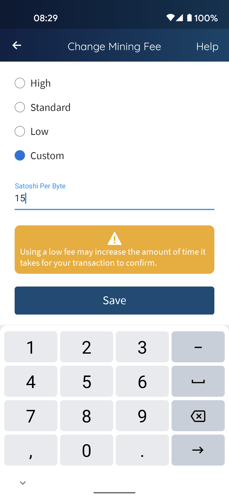
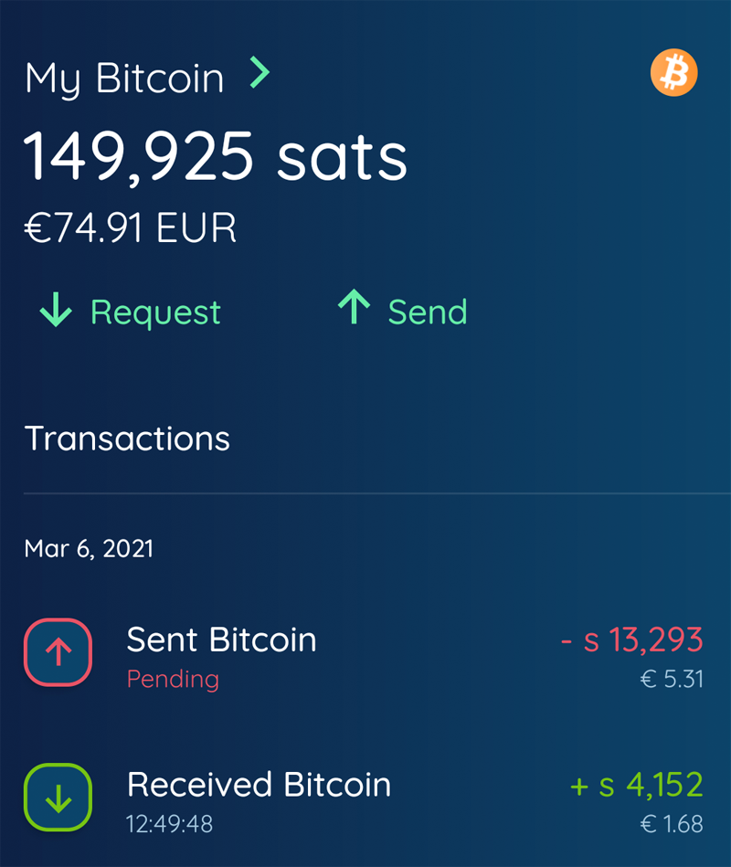

# Usando Bitcoin

## Taxas de transação
Uma taxa de mineração deve ser paga para cada transação bitcoin e essas taxas são necessárias para que a operação da rede Bitcoin continue. O trabalho dos mineradores é recompensado com essas taxas e bitcoins recém-criados (veja o capítulo 2.3). A mineração é um fator essencial no protocolo Bitcoin. Depois que um bloco de transações é minerado, ele é anexado ao blockchain. Esta é a maneira de garantir a segurança da rede. Como o Bitcoin tem um limite de oferta fixo de 21 milhões de moedas, os mineradores não receberiam mais nenhuma remuneração por seu desempenho após atingir esse fornecimento máximo e não teriam mais interesse em processar transações e, assim, manter o blockchain. Portanto, Satoshi Nakamoto introduziu taxas de transação. De acordo com o white paper, o objetivo é manter essas taxas mais baixas do que as taxas e custos comparáveis ​​do sistema bancário tradicional. No entanto, não é verdade que as transferências sejam gratuitas simplesmente porque, em teoria, não há necessidade de intermediários ou bancos.

Quando você está comprando bitcoin por meio de uma exchange, a taxa de transação (taxa de mineração) geralmente não é ajustável e é fixada pelo provedor.

Na sua carteira Bitcoin sem custódia, você mesmo pode determinar a taxa de transação para pagamentos efetuados. Quanto mais alta você definir a taxa, mais rápido sua transação será processada pelos mineradores, porque eles escolhem as transações com as taxas mais altas primeiro. Se a sua transferência não for sensível ao tempo, você pode escolher uma taxa mais baixa.

Para ter mais controle, você pode estimar a taxa e a velocidade de confirmação em páginas como [Mempool.space](https://mempool.space/) ou [Johoe's Bitcoin Mempool](https://jochen-hoenicke.de/queue/) . Esses sites exibem o número e o tamanho de todas as transações não confirmadas. Eles dão uma visão em tempo real e mostram como o Mempool evolui. As transações são coloridas pelo valor da taxa paga por byte (virtual).

 [^74]

Abaixo você pode ver as configurações na carteira Edge. Você pode escolher um dos intervalos da taxa de transação padrão ou um valor personalizado.

 [^75]

**Transação pendente**
Como novos blocos são extraídos a cada 10 minutos, levará em média pelo menos 10 minutos até que sua transação seja confirmada. Se você definir a taxa de transação muito baixa, sua transação poderá ficar pendente por um período mais longo, pois o Mempool é liberado e os mineradores começam a incluir novamente transações com taxas mais baixas. Aqui você vê uma das minhas transações que ficou presa no Mempool por um mês.
 [^76]
Você pode consultar o status de sua transação em um [Blockchain explorer](https://blockchair.com). Como você pode ver abaixo, minha transação está a 4.717 ranks de ser minerada com um total de 41.610 transações no Mempool. Eu escolhi uma taxa de 5 sat por vbyte.
 [^77]

Você não precisa seguir as etapas abaixo para confirmar sua transação original. A maioria das transações com taxas baixas permanece válida por dias e, eventualmente, será confirmada. No entanto, existem duas maneiras de resolver o problema da transação travada e confirmá-la mais cedo.

**Uma transação enviada está travada**
* Replace-by-fee (RBF): algumas carteiras permitem que você defina essa opção como sim antes de enviar uma transação. Nesse caso, se a transação original travar, você poderá definir uma taxa mais alta e reenviar a transação.

**Uma transação de entrada está travada**
* O filho paga para os pais (Child pays for parent - CPFP): você pode pensar nisso como um pai com dinheiro insuficiente para suas despesas, então seu filho paga a diferença em nome do pai. CPFP é uma técnica através da qual você pode aumentar lentamente suas transações de confirmação de entrada fazendo uma nova transação com taxas mais altas (transação filha) usando as saídas (fundos) da transação anterior (transação pai) que está travada.

Consulte a documentação da carteira que você está usando para obter instruções detalhadas.

## Compre algo com Bitcoin
Aqui estão alguns diretórios com lojas onde você pode gastar bitcoin.
* [Aceito aqui](https://www.acceptedhere.io)
* [Serviços B2B que aceitam BTC](https://cryptwerk.com/companies/b2b/btc/)
* [Coinmap](https://coinmap.org/view/) lojas físicas que aceitam Bitcoin
* Diretório [Gastando Bitcoin](https://spending-bitcoin.com/)
* Diretório [UseBitcoins](https://usebitcoins.info/)

## Cartões de débito Bitcoin
Você pode usar um cartão de débito Bitcoin para comprar qualquer coisa como qualquer outro cartão de débito bancário. A diferença é que é carregado com bitcoin ou altcoins. Os comerciantes são pagos em sua própria moeda pela empresa de débito e a cobrança será deduzida do seu saldo de bitcoin, o que permite que você viva exclusivamente através do bitcoin.

Você precisará depositar seu bitcoin na empresa do cartão de débito, o que significa que você dá o controle sobre suas moedas a terceiros. Deposite apenas o quanto você precisa no cartão e verifique as taxas que essas empresas de cartão cobram.

Uma pequena lista de cartões que estão disponíveis no momento:
Cryptocom Visa, Binance, Bitpanda Visa, Coinbase Visa, Wirex Visa, BlockCard, Cryptopay, Nexo, Bitwala Visa, BitPay Visa, Cash App

## Gastar e Receber
A seguir estão as ferramentas e serviços que permitem que você gaste e receba BTC em sua vida diária.
* [Bity](https://bity.com/products/crypto-online-bill-pay/) pague contas online com bitcoin
* [Cash App](https://cash.app/bitcoin) compre e venda BTC diretamente do seu saldo do Cash App
* [Strike](https://global.strike.me/) envie e receba pagamentos internacionais instantâneos, remessas instantâneas e com acesso total à rede Bitcoin
* [Piixpay](https://www.piixpay.com/?lang=en) pague qualquer pessoa em EURO usando sua criptomoeda
* [Bitrefill](https://www.bitrefill.com/?hl=en) compre vales-presente e recargas de telefone

[^74]: [Captura de tela por Anita Posch](https://mempool.space)
[^75]: Captura de tela de Anita Posch, carteira Edge
[^76]: Captura de tela de Anita Posch, carteira Edge
[^77]: Captura de tela de Anita Posch, Blockchair
