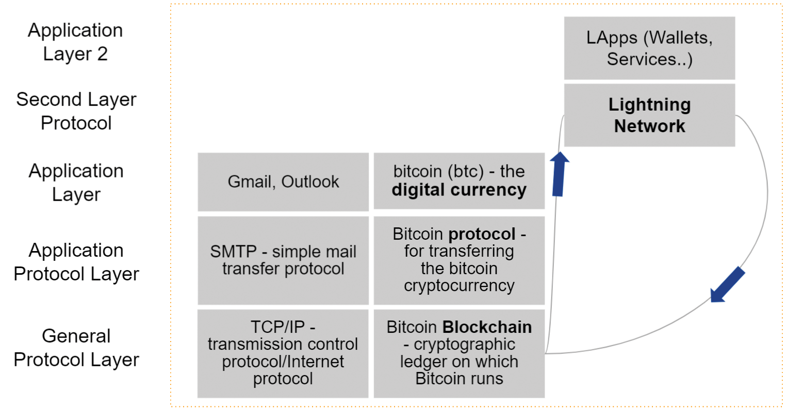

## Bitcoin the Internet of Values

Bitcoin is more than a digital coin or internet-native money. It is a public internet infrastructure. It is an internet protocol through which values are exchanged between computers operated by humans, but also by autonomous machines themselves. For example, cars won’t only drive autonomously in the future, but will also navigate to the charging station on their own for recharging. In this scenario, the payment is made automatically via bitcoin without anyone having to intervene manually.

A protocol governs the exchange of information or procedures. Language is a protocol. When I speak and take a short break, my counterpart knows that she can speak now. Every word in a conversation has a meaning, every expression changes the tone of a conversation. The human language protocol regulates the communication between two or more people. Computers also talk to each other. For example, their protocols are SMTP for email transmission, FTP for sending files, or HTTPS for visiting web pages. The respective protocol determines how data is exchanged with each other so that one computer can understand the other.

### Internet Protocol Stack
The Bitcoin protocol can be compared to the structure of the internet protocol stack.

 [^23]

The Bitcoin blockchain is a new internet protocol comparable to the TCP/IP protocol, which is the basis of the internet. On top of the Bitcoin blockchain, the Bitcoin protocol transfers bitcoin values similar to the SMTP protocol for sending emails. On top of that, there is bitcoin as an application comparable to email software such as Gmail or Outlook. This is called the base layer of Bitcoin.

### The Lightning Network

On top of the base layer protocol, additional layers can be built, such as the Lightning Network, which has been operating since 2018. That is why it is called the second-layer or layer two protocol. The Lightning Network enables fast and small payments, which are necessary due to the restricted block size technically not possible on the Bitcoin base layer. It also brings more privacy while using bitcoin, since it is operating through private payment channels between thousands of nodes. Lightning payments hop from one node to the other, making it impossible to know who the payment sender is. Applications like wallets, lending services and more are being built on top of the Lightning protocol, bringing Bitcoin's security properties with it. 

[^23]: Anita Posch inspired by [Melanie Swan](https://www.slideshare.net/lablogga/bitcoin-and-blockchain-explained-cryptocitizen-smartnetwork-trust)
