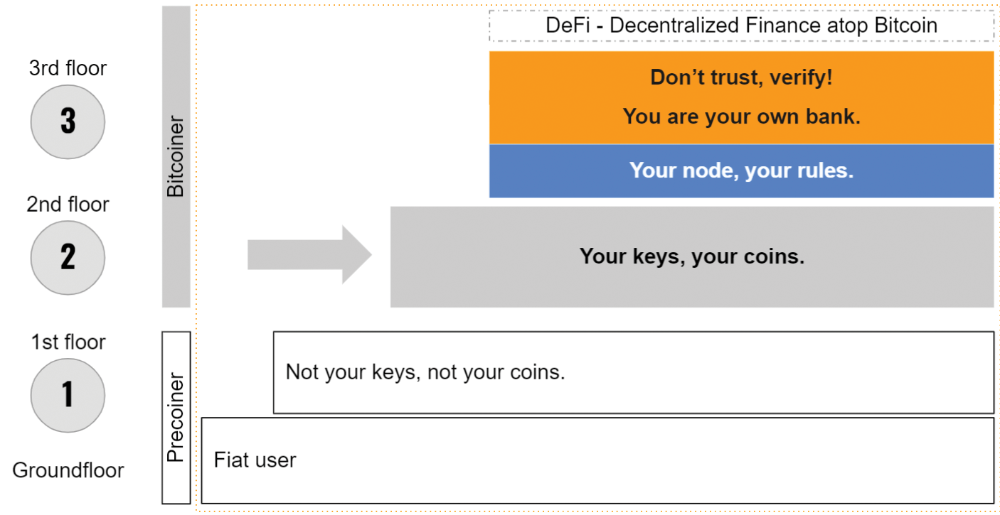

# The Staircase of Financial Sovereignty

>; "Not your keys, not your coins." - **Andreas M. Antonopoulos**

As you have read in the previous chapters, Bitcoin's primary strength is its uncensorability, which gives you financial sovereignty. That is - besides the fixed 21 million supply - the main differentiator to all other forms of money. It protects you from bail-ins like in Cyprus in 2014 and from devaluing your funds through inflation. It ends the enforced financialization of your money through banking and financial products. It gives you full control over your funds, enables you to move globally while bringing your money with you. It's an alternative, an opt-out of the fiat system - all you need are 12 English words: your seed phrase.

>;"Bitcoin is uncensorable and non-inflatable. These are its most important properties." - **Anita Posch**

If you do not have those seed phrase words, you do not have the privileges and the freedom stated above.

## Risks of Custodial Wallets
It's important to note that there is a big difference between custodial wallets and non-custodial wallets. You only get control of the seed phrase when you use a non-custodial (self-hosted) wallet. Exchanges like Coinbase, Kraken, Binance, Bitpanda, etc., do not give you the private keys to your own wallets. While it might be more convenient to hold bitcoin in a wallet on a centralized exchange, it's no different to a bank. You do not own the bitcoin in your exchange account, which can be a big problem in case the exchange gets hacked, which has already happened many times. For instance, I remind you of Mt. Gox, the biggest hack to date that happened in 2014. No day goes by without cases of frozen accounts, or flagging of tainted coins and, sometimes, the regulatory halting of trading. On top of that, those exchanges need you to register and fulfill all KYC identification requirements (know-your-customer and anti-money laundering regulations), which is a hurdle for billions of people, excluding them from banking and now from using crypto exchanges too. On top of that, these KYC regulations are intruding on your privacy. Luckily, Bitcoin is built for everyone. To mitigate the counter-party risks of custodial wallets you should skip these exchanges and use a non-custodial wallet from the start.

>;"This illusion that money in the bank is safer than money under the mattress is very much a position of privilege." - **Andreas M. Antonopoulos**

For people outside of the "western developed world", there is no such thing as a secure bank account. This is a privilege. You might think you would rather leave your money on the exchange because you don't want to have the hassle and responsibility of holding your own money. You can do that, but it's not what Satoshi Nakamoto intended and it makes you vulnerable.

Once you have learned and executed the steps to financial freedom, you will see that it is not as difficult as it may first sound.

## 3 Steps to Financial Sovereignty

>;"With great freedom, comes great responsibility." - **Dr. Stephanie Murphy**

Stephanie Murphy, Co-host of the "Speaking of Bitcoin" podcast, frames the financial freedom model as a staircase with different levels of sovereignty. Since Bitcoin is a technology in development, the grade of freedom that one can reach is changing all the time. This book will give you guidance to reach step 2: the "Your keys, your coins" level. Reaching the "Don't trust, verify" level will become much easier in the coming years. At the moment it requires technical know-how and a greater effort in time and resources, but in principle, everyone can reach it.

 [^68]

**Groundfloor** You are a pre-coiner, since you read my book you are interested in Bitcoin, but do not own any.

**1st floor** You are getting to know BTC with a custodial solution on a centralized exchange, you don't control any of the keys. You have some independence because you're invested in a cryptocurrency and not solely fiat anymore. But it's not a lot of independence because you rely on a third party, which comes with the counter-party risks mentioned above. You are on the **"not your keys, not your coins"** level.

Ideally, you skip the first floor and go to the 2nd floor as fast as possible.

**2nd floor** You take control of your keys and store them securely yourself on a non-custodial wallet that gives you your seed. This is a much higher degree of financial sovereignty. You can do that with a mobile wallet on your smartphone for small amounts or - the best way and highly recommended - with a hardware wallet for bigger amounts. You reach the **"your keys, your coins"** level. You have reached a very high level of independence.

From here on the steps are for experienced users, they give you even more sovereignty, privacy and control over your bitcoin.

**3rd floor** You get full sovereignty over your funds by connecting your hardware wallet with your own full node. With this setup, you can not only view and receive information about your transactions but also verify mined blocks and transactions without relying on 3rd parties. You don't have to trust anyone else anymore and have a high level of privacy and control. **"You are your own bank"** and have now reached the **"Don't trust, verify"** level.

You can take these security and independence measures even further with air-gapped solutions, multi-sig setups and more.

On top of that staircase, decentralized financial solutions like bitcoin borrowing and lending are emerging.

Ultimately, if all you want to do is hedge against inflation and use Bitcoin as a store of value, **reaching the 2nd floor, "your keys, your coins" is the goal**. I will show you how to reach this level of sovereignty in the next chapters.

[^68]: Anita Posch
